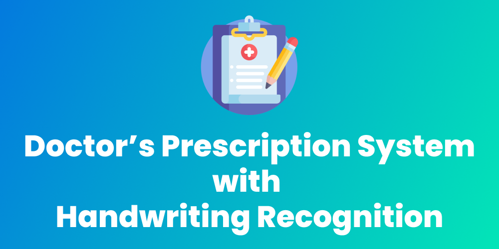

# Doctor's Prescription System

This project uses handwriting recognition to recognize the names of medicines from a doctor's prescription. This is done using a Convolutional Neural Network (CNN) developed using the Tensorflow Framework and OpenCV.

The project can be divided into two distinct components as follows -

1. Handwriting Recognition Pipeline
2. Doctor's Prescription System App

# Contents

- [Handwriting Recognition Pipeline](#handwriting-recognition-pipeline)
  - [Technologies Used](#technologies-used)
  - [Dataset](#dataset)
  - [Model Training](#model-training)
  - [Deployment](#deployment)
    - [Step 1: Loading and Resizing](#step-1-loading-and-resizing)
    - [Step 2: Grayscale Conversion](#step-2-grayscale-conversion)
    - [Step 3: Image Processing](#step-3-image-processing)
    - [Step 4: Thresholding](#step-4-thresholding)
    - [Step 5: Contour Detection](#step-5-contour-detection)
    - [Step 6: Cropping & Character Recognition](#step-6-cropping--character-recognition)
    - [Step 7: Result](#step-7-result)
- [Android App](#android-app)
  - [Technologies Used](#technologies-used-1)
  - [Sign In Page](#sign-in-page)
  - [Sign Up Page](#sign-up-page)
  - [Doctor's Dashboard Page](#doctors-dashboard-page)
  - [Patient's Dashboard Page](#patients-dashboard-page)
  - [Prescription Scanning](#prescription-scanning)

# Handwriting Recognition Pipeline

The handwriting recognition pipeline is the core component of this project. The pipeline essentially takes an input image and extracts the 'handwritten words' from this image. These words can later be used to check if any matches are found in the medicines database.

## Technologies Used

| Name            | Description                                                                                               |
| --------------- | --------------------------------------------------------------------------------------------------------- |
| TensorFlow      | TensorFlow is a free and open-source software library for machine learning.                               |
| Keras           | Keras is an open-source software library that provides a Python interface for artificial neural networks. |
| OpenCV          | OpenCV is a library of programming functions mainly aimed at real-time computer vision.                   |
| TensorFlow Lite | TensorFlow Lite is an open source deep learning framework for on-device inference.                        |

## Dataset

The handwritten character recognition model was trained on the [EMNIST dataset](https://www.kaggle.com/crawford/emnist). The data was read from a CSV file and converted into numpy arrays without any pre-processing or data augmentation. The properties of the EMNIST dataset are as follows -

1. Number of classes - 47
2. All Classes - 0123456789ABCDEFGHIJKLMNOPQRSTUVWXYZabdefghnqrt
3. Image Size - 28x28x1 ( 28x28 pixel grayscale image)
4. Number of training images - 112,800
5. Number of testing images - 18,800

## Model Training

The handwritten character recognition model was developed using Tensorflow and Keras. It is a Multi-layer CNN (Convolutional Neural Network) which achieved a validation accuracy of **86%** after training for **20 epochs**. The model performed favorably on the test set and only failed in certain outlier conditions where some characters looked like other characters (For example: 4 looked like 9, I looked like l, etc.). The architecture of the model is as follows -

- 2 X Conv2D → Batch Normalization → ReLU → MaxPooling2D
- Dropout
- 1 X Conv2D → Batch Normalization → ReLU → MaxPooling2D
- Dropout
- 1 X Conv2D → Batch Normalization → ReLU → MaxPooling2D
- Dropout
- 1 X Cond2D → Batch Normalization → ReLU
- Flatten
- Dense
- Dropout
- Dense (Output Layer)

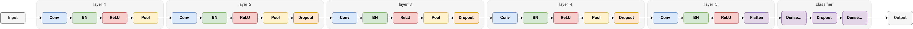

## Deployment

The handwriting recognition model was deployed to the android application using the TensorFlow Lite library. For the handwriting recognition to take place, a series of steps are followed to make sure that the image is processed properly and the relevant data is fed to the model for handwritten character recognition. The steps followed in the processing and handwritten character recognition on an input image are as follows -

### **Step 1: Loading and Resizing**

The image is loaded using OpenCV's `imread` function and is then resized using the `resize` function to make an image having the dimensions of **300x300 pixels**.

Here what the image looks like after loading and resizing.

  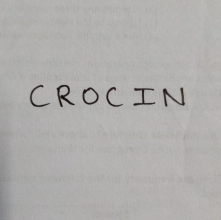

### **Step 2: Grayscale Conversion**

The image is converted into a grayscale image using the `cvtColor` function along with the `COLOR_RGB2GRAY` color space conversion code. The image is converted into a grayscale image primarily because the dataset consisted of grayscale images and also because converting the original into a grayscale image will boost the contrast between the ink and the paper.

Here's what the image looks like after grayscale conversion.

  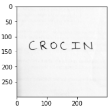

### **Step 3: Image Processing**

Multiple image processing functions are applied in order to boost the contrast and to separate out the handwritten text from the background. The series of image processing operations applied are as follows -

- **absdiff**: This function calculated the difference between each pair of corresponding elements in the given arrays. To apply this function, a copy of the grayscale image is made and a median blur is applied to it. Median Blurring takes the median of all the pixels under the kernel area and the central element is replaced with this median value. The `absdiff` function then calculates the difference between the grayscale image and the image with median blurring applied. This process helps to remove any noise from the image.
- **normalize**: The `normalize` function normalizes the image so that the min value of any pixel is 0 and the max value is 255. The `NORM_MINMAX` normType is specified to carry out this process.
- **morphologyEx**: The `morphologyEx` is applied along with the **opening** operator. This helps to reduce any noise that may be present in an image.
- **clahe**: CLAHE or Contrast Limited Adaptive Histogram Equalization is the last image processing operator that is applied on the image. It helps to increase the contrast of the given image. This helps to make contour finding more accurate.

Here's what the image looks like after all the image processing operations are applied on the image. We can see that the contrast has been boosted and any existing shadows have been removed to some extent.

  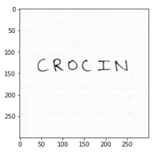

### **Step 4: Thresholding**

The **threshold** function is used to apply thresholding. For every pixel, the same threshold value is applied. If the pixel value is smaller than the threshold, it is set to 0, otherwise it is set to a maximum value. This generates an image of binary pixel values.

Here's what the image looks like after the thresholding operation has been applied. We can see that the background and foreground (text) have been clearly separated.

  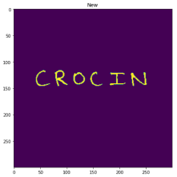

### **Step 5: Contour Detection**

Contours can be explained simply as a curve joining all the continuous points (along the boundary), having same color or intensity. The contours are a useful tool for shape analysis and object detection and recognition. We can use this technique to find the individual characters in an image. These characters can then be cropped out and sent to the model to perform the task of character classification.

The image below shows how contours get detected from the threshold image and we get the bounding boxes for each character.

  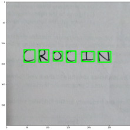

### **Step 6: Cropping & Character Recognition**

After we have found the bounding boxes for all the individual characters in the image, we can crop out the individual characters to make it easy to perform the task of character recognition. At the same time, the characters are grouped together by taking into consideration the **x** and **y** coordinates of the bounding boxes. Doing this allows us to later combine the predictions to form words and ultimately get the name of the medicine in the given prescription.

Here's what the characters look like after we crop them and group / order them according to the **x** and **y** coordinates of their bounding boxes.

  

### **Step 7: Result**

After all the predictions have been made, the groups are combined in order to get words. After we get the predicted words (name of the medicine), the result is passed through a matching algorithm. This is done to remove any errors in the prediction. (for example: sometimes the medicine 'crocin' may get predicted as 'crocim') After these errors are removed, we get the full name of the medicine and we can use this to search for more information about the medicine in the database.

# Android App

The android app for the project was built using Flutter. The app stores the user information in the Cloud Firestore database and any images that the user scans are uploaded to Firebase Storage. This app essentially provides an interface for the Handwriting Recognition Model.

## Technologies Used

| Name             | Description                                                                                                                                                                                            |
| ---------------- | ------------------------------------------------------------------------------------------------------------------------------------------------------------------------------------------------------ |
| Flutter          | Flutter is an open-source UI software development kit created by Google. It is used to develop applications for Android, iOS, Linux, Mac, Windows, Google Fuchsia, and the web from a single codebase. |
| Cloud Firestore  | Cloud Firestore is a flexible, scalable database for mobile, web, and server development from Firebase and Google Cloud.                                                                               |
| Firebase Storage | Cloud Storage for Firebase is a powerful, simple, and cost-effective object storage service built for Google scale.                                                                                    |
| TF Lite Android  | TensorFlow Lite is a set of tools that enables on-device machine learning by helping developers run their models on mobile, embedded, and IoT devices.                                                 |

## Sign In Page

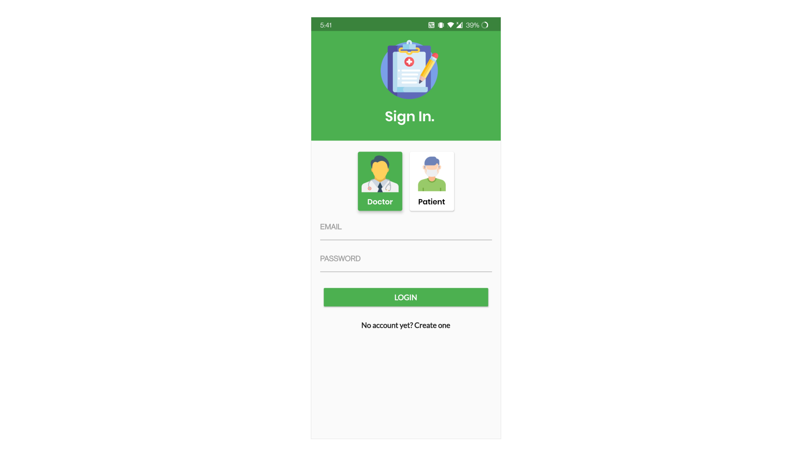

The Sign In Page allows a doctor or a patient to sign into the application. The user can select if they're a doctor or a patient and can enter their username and password. Additionally, the users can tap the create account button to create a new account. The authentication for the app is handled using the Firebase Authentication service and uses the email and password Authentication along with email validation to manage the authentication flow.

## Sign Up Page

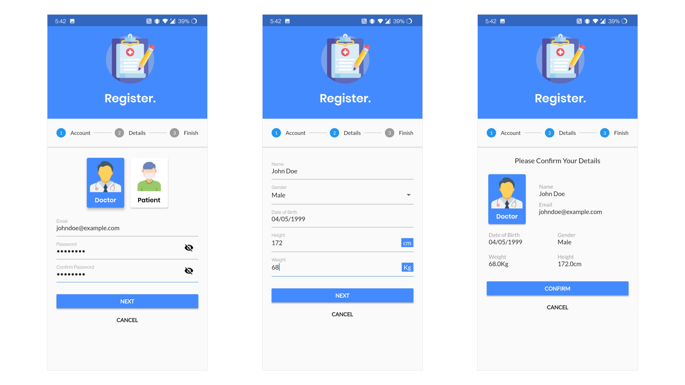

The Sign Up page has multiple steps that are used to collect the data required to create a user's account. Initially, the user has to select whether they are a doctor or a patient and enter their email address and choose a password. In the next step, the users have to enter their name, gender, date of birth, height and weight. After they have entered the information, they will be shown a summary of all the information that they have entered. When the user clicks on the confirm button, a verification email is sent to their email address and they can then sign in to the application after verifying their email address.

## Doctor's Dashboard Page

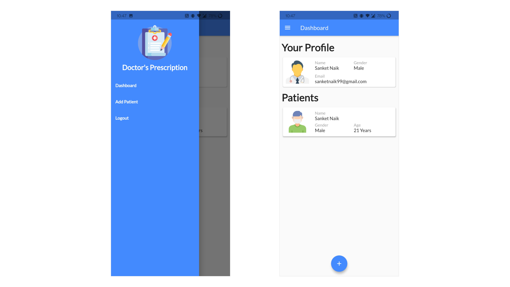

The Doctor's Dashboard page allows a doctor to view their patients and their information. This dashboard also has an action button which lets the doctor scan the QR Code of a patient which will add the patient's information to the doctor's database. The sidebar on this page has navigation buttons for the dashboard page, add patient page and a button to logout from the application.

## Patient's Dashboard Page

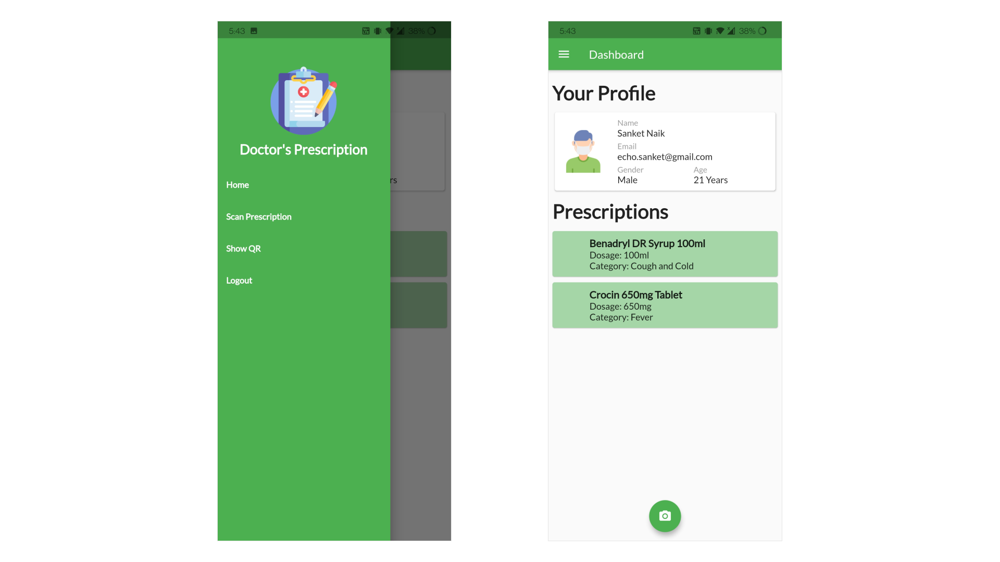

The Patient's Dashboard page shows a patient their information along with the current prescription that have been assigned to them. The dashboard also has an action button which allows the patient to scan a new prescription. Additionally, the sidebar provides navigation buttons which let the patient navigate to the Dashboard, Prescription Scanning Page, QR Generation Page and a button to logout from the application.

## Prescription Scanning

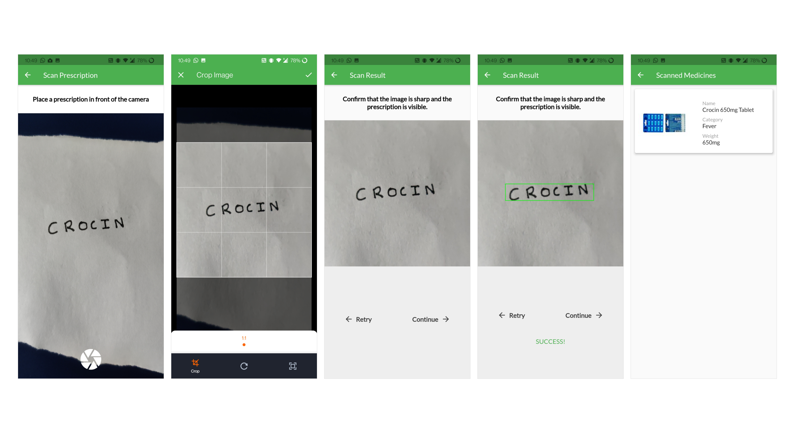

When a patient clicks on the scan prescription button or the action button on the patient dashboard, they are directed to the prescription scanning page. The scanning page shows the patient a camera preview. The patient can use this to capture an image of their prescription. Once the patient has captured an image of the prescription, a cropping screen is displayed which lets them crop the image to remove any background objects. When the patient is satisfied with the cropped image, they can click the done button. The patient is then shown a confirmation page where the image is displayed. The patient has to make sure that the image is sharp and the prescription is visible so that the recognition process is efficient and accurate. The patient can tap the retry button to click another image or tap the continue button to proceed with the recognition process.

If the patient taps on the continue button, the image is passed to the handwriting recognition pipeline. After getting the result from the handwriting recognition pipeline, the app runs a similarity detection check in the medicine database. This is done to minimize any errors and to get the exact name of the medicine. When a match is found, the medicine name along with its details is displayed to the patient and is added to the patient's prescription database.
